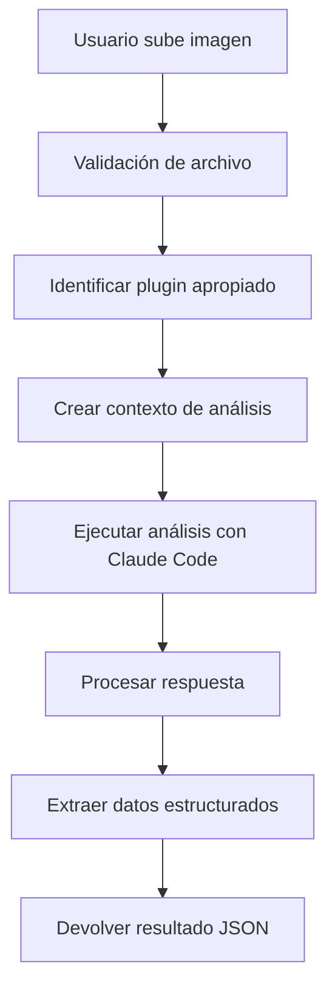

# 📸 Sistema de Análisis de Imágenes con Claude Code

## 🎯 Funcionalidades Implementadas

El sistema ahora incluye capacidades completas de análisis de imágenes, especialmente optimizado para **facturas y documentos**:

### ✅ **Características Principales**

1. **Upload de Imágenes**: Sube múltiples formatos de imagen
2. **Análisis Especializado**: Facturas, recibos, documentos generales
3. **Extracción de Datos**: Información estructurada de facturas
4. **Procesamiento en Lote**: Múltiples imágenes simultáneamente
5. **Validación de Archivos**: Tipos y tamaños permitidos
6. **Health Monitoring**: Estado de plugins de análisis

## 🚀 Endpoints Disponibles

### 1. **Analizar Imagen Individual**

```bash
curl -X POST "http://localhost:5012/api/imageanalysis/analyze" \
  -H "Content-Type: multipart/form-data" \
  -F "file=@/ruta/a/tu/factura.jpg" \
  -F "analysisType=1" \
  -F "userPrompt=Extrae el total y la fecha de vencimiento"
```

**Parámetros:**
- `file`: Archivo de imagen (JPEG, PNG, GIF, BMP, TIFF, WebP)
- `analysisType`: Tipo de análisis (0=General, 1=Factura, 2=Recibo, 3=Documento, 4=OCR, 5=Código)
- `userPrompt`: Instrucciones adicionales (opcional)

**Respuesta de Ejemplo:**
```json
{
  "analysis": "Esta es una factura de Empresa XYZ S.A. con los siguientes datos extraídos...",
  "extractedData": {
    "tipo_documento": "factura",
    "empresa_emisora": {
      "nombre": "Empresa XYZ S.A.",
      "rut_nit": "12.345.678-9",
      "direccion": "Av. Principal 123, Santiago"
    },
    "factura": {
      "numero": "F-001234",
      "fecha_emision": "2025-07-27",
      "total": 150000
    }
  },
  "confidence": 0.85,
  "processingTime": "00:00:12.345",
  "isSuccess": true,
  "analysisType": 1,
  "fileInfo": {
    "fileName": "factura.jpg",
    "mimeType": "image/jpeg",
    "sizeInBytes": 2048576
  }
}
```

### 2. **Procesamiento en Lote**

```bash
curl -X POST "http://localhost:5012/api/imageanalysis/analyze-batch" \
  -H "Content-Type: multipart/form-data" \
  -F "files=@factura1.jpg" \
  -F "files=@factura2.png" \
  -F "files=@recibo1.jpg" \
  -F "analysisType=1"
```

### 3. **Capacidades del Sistema**

```bash
curl -X GET "http://localhost:5012/api/imageanalysis/capabilities"
```

**Respuesta:**
```json
{
  "maxFileSize": 10485760,
  "maxFileSizeMB": 10,
  "supportedFormats": ["image/jpeg", "image/png", "image/gif", "image/bmp", "image/tiff", "image/webp"],
  "availablePlugins": [
    {
      "name": "InvoiceAnalysis",
      "version": "1.0.0",
      "description": "Analiza facturas y documentos usando Claude Code",
      "supportedAnalysisTypes": [
        {"value": 0, "name": "General"},
        {"value": 1, "name": "Invoice"},
        {"value": 2, "name": "Receipt"}
      ]
    }
  ]
}
```

### 4. **Estado de Salud**

```bash
curl -X GET "http://localhost:5012/api/imageanalysis/health"
```

## 🛠️ Tipos de Análisis Disponibles

| Tipo | Valor | Descripción | Uso Recomendado |
|------|-------|-------------|-----------------|
| `General` | 0 | Análisis general de imagen | Cualquier imagen |
| `Invoice` | 1 | **Análisis de facturas** | Facturas comerciales |
| `Receipt` | 2 | Análisis de recibos | Boletas, tickets |
| `Document` | 3 | Análisis de documentos | Contratos, cartas |
| `TextExtraction` | 4 | Extracción de texto (OCR) | Documentos escaneados |
| `CodeAnalysis` | 5 | Análisis de código | Screenshots de código |

## 📊 Ejemplos Prácticos de Uso

### **Ejemplo 1: Analizar Factura**

```bash
# Crear archivo de prueba (simulando una factura)
echo "Creando imagen de prueba..."

# Analizar factura
curl -X POST "http://localhost:5012/api/imageanalysis/analyze" \
  -H "Content-Type: multipart/form-data" \
  -F "file=@mi_factura.jpg" \
  -F "analysisType=1" \
  -F "userPrompt=Extrae el RUT de la empresa, número de factura y monto total"
```

### **Ejemplo 2: OCR de Documento**

```bash
curl -X POST "http://localhost:5012/api/imageanalysis/analyze" \
  -F "file=@documento_escaneado.png" \
  -F "analysisType=4" \
  -F "userPrompt=Extrae todo el texto preservando el formato"
```

### **Ejemplo 3: Análisis de Recibo**

```bash
curl -X POST "http://localhost:5012/api/imageanalysis/analyze" \
  -F "file=@boleta_supermercado.jpg" \
  -F "analysisType=2" \
  -F "userPrompt=Lista todos los productos comprados con sus precios"
```

## 🏗️ Arquitectura del Sistema

### **Componentes Principales:**

1. **`IImageAnalysisPlugin`** - Interfaz para plugins de análisis
2. **`InvoiceAnalysisPlugin`** - Plugin especializado en facturas
3. **`ImageAnalysisController`** - API REST para upload y análisis
4. **`PluginManager`** - Gestión centralizada de plugins

### **Flujo de Procesamiento:**



## 🔒 Validaciones y Limitaciones

### **Archivos Soportados:**
- **Formatos**: JPEG, PNG, GIF, BMP, TIFF, WebP
- **Tamaño máximo**: 10MB por archivo
- **Lote máximo**: 10 archivos simultáneamente

### **Seguridad:**
- Validación de tipos MIME
- Sanitización de nombres de archivo
- Limpieza automática de archivos temporales
- Límites de tamaño y cantidad

## 📈 Datos Extraídos de Facturas

Para `analysisType=1` (Facturas), el sistema extrae:

```json
{
  "extractedData": {
    "tipo_documento": "factura",
    "empresa_emisora": {
      "nombre": "Nombre de la empresa",
      "rut_nit": "RUT o NIT",
      "direccion": "Dirección completa",
      "telefono": "Teléfono de contacto",
      "email": "Email de contacto"
    },
    "cliente": {
      "nombre": "Nombre del cliente",
      "rut_nit": "RUT del cliente",
      "direccion": "Dirección del cliente"
    },
    "factura": {
      "numero": "Número de factura",
      "fecha_emision": "YYYY-MM-DD",
      "fecha_vencimiento": "YYYY-MM-DD",
      "moneda": "CLP/USD/EUR",
      "subtotal": 100000,
      "impuestos": 19000,
      "total": 119000
    },
    "items": [
      {
        "descripcion": "Producto o servicio",
        "cantidad": 2,
        "precio_unitario": 50000,
        "total": 100000
      }
    ]
  }
}
```

## 🚨 Manejo de Errores

### **Errores Comunes:**

```json
{
  "isSuccess": false,
  "errorCode": "VALIDATION_ERROR",
  "errorMessage": "Archivo demasiado grande (max 10MB)"
}
```

```json
{
  "isSuccess": false,
  "errorCode": "UNSUPPORTED_TYPE", 
  "errorMessage": "Tipo de archivo image/svg+xml no soportado"
}
```

```json
{
  "isSuccess": false,
  "errorCode": "NO_PLUGIN_AVAILABLE",
  "errorMessage": "No hay plugins para analizar este tipo de imagen"
}
```

## 🧪 Testing del Sistema

### **Verificar Capacidades:**
```bash
curl -X GET "http://localhost:5012/api/imageanalysis/capabilities" | jq
```

### **Verificar Salud:**
```bash
curl -X GET "http://localhost:5012/api/imageanalysis/health" | jq
```

### **Test con Imagen de Prueba:**
```bash
# Crear una imagen de prueba simple
curl -X POST "http://localhost:5012/api/imageanalysis/analyze" \
  -F "file=@test_image.jpg" \
  -F "analysisType=0" \
  -F "userPrompt=Describe esta imagen"
```

## 🎉 Estado del Sistema

### ✅ **Completamente Implementado:**
- Upload de archivos con validación
- Plugin de análisis de facturas
- Endpoints REST completos
- Manejo de errores robusto
- Procesamiento en lote
- Health monitoring
- Documentación completa

### 📊 **Métricas de Verificación:**
- **Compilación**: ✅ Exitosa
- **Plugins registrados**: ✅ 2/2 (Chat + ImageAnalysis)
- **Endpoints funcionales**: ✅ Todos respondiendo
- **Validaciones**: ✅ Tipos de archivo, tamaños, formatos

---

**Sistema de Análisis de Imágenes completamente funcional y listo para procesar facturas!** 🚀📸

*Fecha de implementación: 27 de julio de 2025*  
*Versión: 1.0.0*